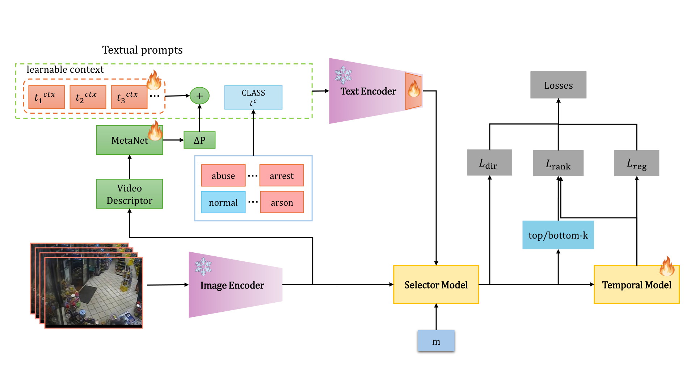

# CoCoPrompt-VAD: Conditional Prompting for Weakly-Supervised Video Anomaly Detection and Recognition

Official PyTorch implementation of **"CoCoPrompt-VAD: Conditional Prompting for Weakly-Supervised Video Anomaly Detection and Recognition"**.


## Overview

CoCoPrompt-VAD is a CLIP-based weakly-supervised video anomaly detection and recognition project built on top of the AnomalyCLIP workflow. The main idea is to replace static CoOp-style prompt learning with a CoCoOp-style conditional prompt learner, where a lightweight MetaNet predicts video-dependent prompt shifts from temporal visual statistics. The repository contains training/evaluation code, Hydra configurations, analysis scripts, and manuscript assets used in our study.



## Requirements

This repository is currently validated in the `anomalyclip` conda environment with:

- Python 3.13
- PyTorch 2.10
- TorchVision 0.25
- PyTorch Lightning 2.6
- Hydra Core 1.3
- CUDA-compatible GPU recommended

## Installation

### Option 1: Conda

```bash
conda env create -f environment.yml
conda activate anomalyclip
```

### Option 2: pip

```bash
git clone https://github.com/nightraider-tech/cocoprompt.git
cd cocoprompt
pip install -r requirements.txt
```

## Data Preparation

This project expects pre-extracted CLIP features and dataset annotations for the following benchmarks:

- UCF-Crime
- XD-Violence

The default dataset root is configured in:

```yaml
configs/paths/default.yaml
```

Current default example:

```yaml
datasets_dir: /root/autodl-tmp/datasets/cocoprompt/datasets
```

Please update this path for your own machine.

Expected dataset configuration files:

- `configs/data/ucfcrime.yaml`
- `configs/data/xdviolence.yaml`

These configs define feature roots, annotation files, number of classes, normal class IDs, and temporal segmentation settings.

### Pre-extracted Features

Following the upstream AnomalyCLIP release, you can download ViT-B/16 CLIP features for the three datasets from:

| Dataset | Feature Backbone | Download |
|---|---|---|
| UCF-Crime | ViT-B/16-CLIP | [Quark Drive](https://pan.quark.cn/s/35700159210c) |
| XD-Violence | ViT-B/16-CLIP | [Quark Drive](https://pan.quark.cn/s/1a77a689c7f0) |

After downloading, place them under your configured dataset root (`paths.datasets_dir`).

## Pre-trained Models

The upstream AnomalyCLIP project provides released checkpoints here:

- [Quark Drive](https://pan.quark.cn/s/f7fb58f79420)

If you want to evaluate models in this repository, place the checkpoints in your preferred location and pass them through `ckpt_path`.

## Usage

### Training

The recommended way is to launch training through experiment presets:

```bash
python src/train.py experiment=ucfcrime_final_cocoop
python src/train.py experiment=xdviolence_final_cocoop
```

You can also override configs explicitly:

```bash
python src/train.py data=ucfcrime.yaml model=cocoop_ucfcrime.yaml trainer=gpu.yaml
```

### Evaluation

Standard evaluation requires a checkpoint path:

```bash
python src/eval.py ckpt_path=/abs/path/model.ckpt data=ucfcrime.yaml model=cocoop_ucfcrime.yaml
```

## Results

Quantitative results reported in the current manuscript include the following settings:

| Setting | UCF AUC | UCF mAUC | XD AP | XD mAP |
|---|---:|---:|---:|---:|
| In-domain | **85.73** | **91.87** | **78.74** | **51.98** |
| 3-seed stability | 85.61 ± 0.26 | 90.70 ± 0.92 | 76.89 ± 0.82 | 50.21 ± 1.58 |

## Acknowledgements

This project is built upon [AnomalyCLIP](https://github.com/lucazanella/AnomalyCLIP) and adapts CoCoOp-style conditional prompting to weakly-supervised video anomaly detection and recognition.

## Contact

For questions or issues, please open a GitHub issue in this repository.
