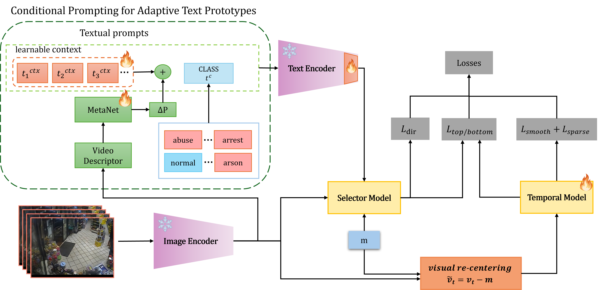

# CoCoPrompt-VAD

Official PyTorch implementation of **CoCoPrompt-VAD: Conditional Prompting for Weakly-Supervised Video Anomaly Detection and Recognition**.

## Overview

CoCoPrompt-VAD is a CLIP-based weakly supervised video anomaly detection and recognition framework built on top of the AnomalyCLIP workflow. It replaces static CoOp-style prompt learning with a CoCoOp-style conditional prompt learner, where a lightweight MetaNet predicts video-dependent prompt shifts from temporal visual statistics. The resulting text prototypes adapt to each input video and support both anomaly detection and anomaly-type recognition.



## Repository Layout

This is the minimal runnable release layout.

```text
CoCoPrompt-VAD/
|-- assets/                  # README figures
|-- configs/                 # Hydra configuration groups and experiment presets
|-- data/                    # Class-label CSV files
|-- src/                     # Training, evaluation, models, data modules, visualization entry points
|-- .project-root            # pyrootutils project marker
|-- environment.yml          # Reproducible conda environment used in the current checkout
|-- pyproject.toml           # Tooling/test configuration
|-- requirements.txt         # Python package lock-style requirement list
|-- setup.py                 # Legacy package metadata
`-- README.md
```

Runtime outputs such as `logs/`, `outputs/`, checkpoints, `ncentroid.pt`, and `eval_results/` are generated artifacts and are not part of the source layout.

## Environment

The checked-in `environment.yml` is aligned with the current tested environment.

Tested setup:

- Python 3.13.11
- PyTorch 2.10.0 + CUDA 12.9 build
- TorchVision 0.25.0
- PyTorch Lightning 2.6.0
- Hydra Core 1.3.1
- GPU smoke tested on NVIDIA GeForce RTX 5060 Laptop GPU

Create the environment:

```bash
git clone https://github.com/nightraider-tech/CoCoPrompt-VAD.git
cd CoCoPrompt-VAD
conda env create -f environment.yml
conda activate cocoprompt
```

If your CUDA driver, GPU, or platform differs, install a PyTorch build matching your machine first, then install the remaining packages from `requirements.txt` or `environment.yml`.

Check CUDA visibility:

```bash
python - <<'PY'
import torch
print('torch:', torch.__version__)
print('cuda build:', torch.version.cuda)
print('cuda available:', torch.cuda.is_available())
print('device count:', torch.cuda.device_count())
if torch.cuda.is_available():
    print('device 0:', torch.cuda.get_device_name(0))
PY
```

## Data Preparation

This project expects pre-extracted CLIP ViT-B/16 features and dataset annotations. The main experiment configs cover:

- UCF-Crime
- XD-Violence

Dataset root is controlled by `paths.datasets_dir` in `configs/paths/default.yaml`. Override it at runtime for portability:

```bash
python src/train.py experiment=ucfcrime_final_cocoop paths.datasets_dir=/path/to/datasets
```

Expected layout:

```text
/path/to/datasets/
|-- UCFCrime/
|   |-- Image-Features/
|   |-- Annotations/
|   |   |-- Anomaly_Train_Abnormal.txt
|   |   |-- Anomaly_Train_Normal.txt
|   |   `-- Anomaly_Test.txt
|   `-- Temporal_Anomaly_Annotation_for_Testing_Videos.txt
`-- XD-Violence/
    |-- Image-Features/
    `-- Annotations/
        |-- Anomaly_Train_Abnormal.txt
        |-- Anomaly_Train_Normal.txt
        |-- Anomaly_Test.txt
        `-- Temporal_Anomaly_Annotation_for_Testing_Videos.txt
```

Class label files are included in `data/`:

- `data/ucf_labels.csv`
- `data/xd_labels.csv`
- `data/sht_labels.csv`

Dataset videos, features, and annotations remain subject to their original licenses and access rules.

### Pre-extracted Features

Following the upstream AnomalyCLIP release, you can download ViT-B/16 CLIP features from:

| Dataset | Feature backbone | Download |
|---|---|---|
| UCF-Crime | ViT-B/16-CLIP | [Quark Drive](https://pan.quark.cn/s/35700159210c) |
| XD-Violence | ViT-B/16-CLIP | [Quark Drive](https://pan.quark.cn/s/1a77a689c7f0) |

After downloading, place the extracted feature folders under your configured dataset root (`paths.datasets_dir`) using the layout above.

## Pre-trained Models

The upstream AnomalyCLIP project provides released checkpoints here:

- [Quark Drive](https://pan.quark.cn/s/f7fb58f79420)

To evaluate a checkpoint with this repository, place it anywhere convenient and pass its absolute path through `ckpt_path`.

## Training

Use the experiment presets. Do not run bare `configs/train.yaml` without overrides, because that file still contains template defaults.

UCF-Crime:

```bash
python src/train.py experiment=ucfcrime_final_cocoop paths.datasets_dir=/path/to/datasets
```

XD-Violence:

```bash
python src/train.py experiment=xdviolence_final_cocoop paths.datasets_dir=/path/to/datasets
```

The final experiment presets default to Weights & Biases. To avoid W&B, override the logger:

```bash
python src/train.py experiment=ucfcrime_final_cocoop logger=csv.yaml paths.datasets_dir=/path/to/datasets
```

Checkpoints are written under the Hydra run directory, usually:

```text
logs/train/runs/<experiment_name>/checkpoints/
```

Training computes and stores `ncentroid.pt`, the normality prototype used for re-centering. Keep the checkpoint and its run artifacts together when possible.

## Evaluation

Standard in-domain evaluation requires an explicit checkpoint path.

UCF-Crime:

```bash
python src/eval.py \
  ckpt_path=/abs/path/to/model.ckpt \
  data=ucfcrime.yaml \
  model=cocoop_ucfcrime.yaml \
  paths.datasets_dir=/path/to/datasets
```

XD-Violence:

```bash
python src/eval.py \
  ckpt_path=/abs/path/to/model.ckpt \
  data=xdviolence.yaml \
  model=cocoop_xdviolence.yaml \
  paths.datasets_dir=/path/to/datasets
```

Evaluation writes metrics, curves, confusion matrices, and raw predictions under the Hydra output directory. If evaluation-side `ncentroid.pt` is missing, it is computed from the configured normal training split.

## Results

The following numbers are from the current manuscript configuration with seed 1024. Detection and recognition metrics are reported separately because CoCoPrompt-VAD primarily improves category-level evidence.

### In-domain comparison

| Method | UCF-Crime AUC (%) | UCF-Crime mAUC (%) | XD-Violence AP (%) | XD-Violence mAP (%) |
|---|---:|---:|---:|---:|
| CoOp baseline | **86.36** | 90.66 | 78.51 | 49.41 |
| CoCoPrompt-VAD | 85.73 | **91.87** | **78.74** | **51.98** |

### UCF-Crime diagnostic configurations

| Setting | Temporal dim | MetaNet | AUC (%) | mAUC (%) |
|---|---:|:---:|---:|---:|
| Baseline | 128 | No | 85.89 | 90.65 |
| CoCoPrompt-VAD | 128 | Yes | 85.73 | **91.87** |
| Baseline | 256 | No | 86.36 | 90.66 |
| CoCoPrompt-VAD balanced diagnostic | 256 | Yes | **86.44** | 90.95 |

### Cross-domain binary transfer

Checkpoints are trained on UCF-Crime and evaluated on the target dataset.

| Target | Baseline AUC (%) | Ours AUC (%) | Baseline AP (%) | Ours AP (%) |
|---|---:|---:|---:|---:|
| XD-Violence | 89.00 | **90.62** | 72.01 | **74.04** |
| ShanghaiTech | 63.75 | **68.49** | 9.87 | **13.59** |

## Reproducibility Notes

- The default experiment seed is `1024`.
- Sampling uses 32 temporal segments and 16 snippets per segment.
- Default Top/Bottom-k mining uses `k=3`.
- Default UCF-Crime and XD-Violence CoCoPrompt configs use `concat_features=False`, `emb_size=128`, one axial-attention block, and frozen CLIP image/text encoders except for `text_projection`.
- `paths.datasets_dir` is machine-specific; override it for every new environment.
- `ncentroid.pt` is a runtime artifact used by train/eval/analysis. Do not delete it from a completed run unless you intend to recompute it.

## Acknowledgements

This project builds on ideas and code structure from:

- [AnomalyCLIP](https://github.com/lucazanella/AnomalyCLIP)
- [CoOp / CoCoOp prompt learning](https://github.com/KaiyangZhou/CoOp)
- CLIP and the weakly supervised VAD benchmark ecosystem

## Citation

A formal BibTeX entry will be added after publication. For now, please cite the manuscript title and this repository if you use the code or results.
